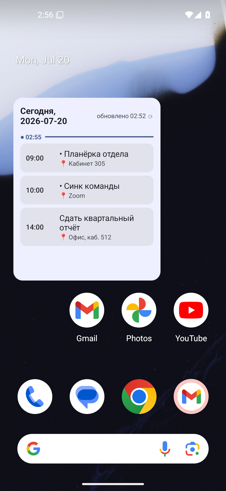
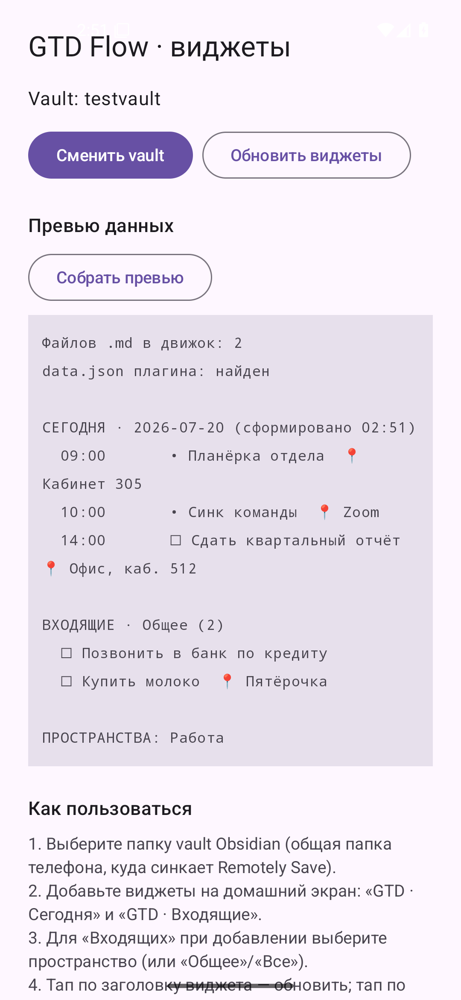

# GTD Flow · Виджеты для Android

Три хоумскрин-виджета поверх vault [Obsidian](https://obsidian.md/) с плагином
[GTD Flow](https://github.com/RudenkoAD/gtd-flow). Виджеты читают **локальную копию**
vault на телефоне (через Storage Access Framework) и показывают день, ближайшие дни и
входящие прямо на домашнем экране — без открытия Obsidian.

- **Сегодня** — почасовая скроллируемая лента дня: события и задачи по времени (время
  одной строкой `HH:mm–HH:mm`), блоки «весь день» сверху, места `📍`, подсветка текущего
  часа. Тап по элементу открывает **шторку деталей** (см. ниже), тап по заголовку — обновляет.
- **Агенда** — лента ближайших дней (7/14/30 — выбирается при добавлении): заголовок дня
  («Сегодня, 20 июля» / «Пн, 21 июля»), под ним элементы дня; пустые дни пропускаются. Тап
  по элементу — та же шторка деталей.
- **Входящие** — список входящих выбранного пространства (по умолчанию **«Все»**) с
  чекбоксами (отметить выполненной прямо из виджета) и кнопкой `＋` для быстрого захвата.
  Тап по задаче открывает малый **оверлей правки** (текст, место, «Выполнено»).

### Шторки-оверлеи (как в Google Calendar / Trello)

- **Шторка события** (тап по элементу «Сегодня»/«Агенды») — нижний оверлей поверх
  домашнего экрана: название, дата + время, «Повторяется: …» для серий, `📍` место; поля
  правки (название, дата — для задач/одноразовых, время, место) и кнопки «Сохранить»,
  «В Obsidian», «Отмена». Для вхождения серии правится **вся серия** (дата вхождения не
  двигается — это отдельная операция).
- **Быстрый захват `＋`** — нижний оверлей с автофокусом и поднятой клавиатурой: поле
  «Что во входящие?», кнопка-стрелка `➤`, раскрывающееся поле `📍` места. После отправки
  поле очищается (серийный ввод), оверлей остаётся открытым — сыпьте задачи одну за другой.

Сохранение правок пишет строку задачи/события обратно в файл через то же ядро
(`buildEditedLine`); если файл успел измениться синхронизацией — правка не применяется, а
виджет предлагает обновиться.

Движок разбора задач — это то же ядро, что и в самом плагине GTD Flow (бандл
`widget-core.js`), исполняемое во встраиваемом JS-движке QuickJS. Значит: те же
пространства, те же правила «сегодня» и «входящих», что и в Obsidian.

## Скриншоты

| Виджет «Сегодня» | Приложение (превью данных) |
| --- | --- |
|  |  |

## Установка

1. Откройте страницу **Releases** этого репозитория и скачайте `gtd-widgets.apk`.
2. На телефоне разрешите установку из этого источника (Android спросит при открытии
   APK) и установите приложение **GTD Flow Widgets**.
3. Требуется Android 8.0 (API 26) или новее.

> APK из релизов подписан релиз-ключом проекта (или debug-ключом, если релиз собран
> без секретов подписи). Приложение не требует интернет-доступа и ничего не отправляет
> наружу — только читает и пишет выбранную папку vault.

## Первый запуск: выбор vault

1. Запустите приложение **GTD Flow Widgets**.
2. Нажмите **«Выбрать vault»** и укажите папку vault Obsidian в общем хранилище
   телефона (ту, куда синхронизируется ваш vault). Android запросит доступ к папке —
   разрешение сохраняется между перезагрузками.
3. Имя выбранной папки используется как имя vault для ссылок `obsidian://` — по
   умолчанию оно совпадает с именем vault в Obsidian.
4. Кнопка **«Собрать превью»** покажет текстовый дамп того, что виджеты возьмут из
   vault (лента дня, входящие, список пространств, ошибки) — удобно для проверки, что
   папка выбрана верно.

## Добавление виджетов на экран

1. Долгий тап по свободному месту домашнего экрана → **Виджеты**.
2. Найдите **«GTD · Сегодня»**, **«GTD · Агенда»** и/или **«GTD · Входящие»** и
   перетащите на экран.
3. Размер виджета можно менять — все списки скроллируются.

### Настройка пространства для «Входящих»

При добавлении виджета «Входящие» откроется экран выбора **пространства** (первым идёт
дефолт нового экземпляра — **«Все»**):

- **Все** — агрегат по всем пространствам; у каждой строки справа серым видна метка
  пространства-источника. Быстрый захват `＋` при «Все» пишет в **«Общее»**;
- **Общее** — задачи вне именованных пространств (корней GTD Flow);
- **имя пространства** — только его входящие (список берётся из `data.json` плагина).

Выбор запоминается для каждого экземпляра виджета отдельно — можно держать на экране
несколько «Входящих» под разные пространства. Быстрый захват `＋` пишет задачу в файл
входящих выбранного пространства (создавая его с `gtd-inbox: true`, если файла ещё нет).

### Настройка числа дней для «Агенды»

При добавлении виджета «Агенда» откроется выбор **числа дней** — **7** (дефолт), 14 или
30. Значение запоминается для каждого экземпляра отдельно.

## Напоминания

Приложение может напоминать о событиях и задачах — **по времени** и **по месту**. Оба
вида по умолчанию выключены; включаются в приложении, секция **«Напоминания»**. Показ
уведомлений на Android 13+ требует разрешения на уведомления (приложение запросит его
при включении; статус и кнопку запроса видно в той же секции).

### По времени

- Тумблер **«Напоминать по времени»** и выбор упреждения: **в момент / 5 / 10 / 30 минут**
  (по умолчанию 10).
- Для каждого события/задачи **с временем** ставится уведомление за выбранное число минут
  до начала. Планируется на ближайшие **~36 часов** и перепланируется при каждом пересчёте
  виджетов (в т.ч. периодическом раз в ~30 минут) и **после перезагрузки** телефона.
- Заголовок уведомления — название, текст — `HH:mm–HH:mm · 📍место · пространство`. Тап
  открывает приложение.
- Если система разрешила **точные будильники**, срабатывание точное; иначе — в окне ±5 мин
  (кнопка **«Настроить»** ведёт в системный экран точных будильников).

### По месту (геофенс, opt-in)

- Тумблер **«Напоминать по месту»**. Для **сегодняшних** элементов с местом ставится
  геофенс радиусом **150 м**; при входе в зону приходит уведомление
  `Рядом: <задача> 📍 <место>`.
- Координаты берутся из строки места `lat, lng` напрямую (например `55.7558, 37.6173`),
  иначе имя места геокодируется. Что не разрешилось в координаты — тихо пропускается.
- Активны до **20** зон одновременно, приоритет — ближайшим по времени.
- Нужны разрешения на геолокацию: сначала обычную, затем **«в фоне»** (запрашиваются
  поэтапно из настроек). Без них тумблер держится выключенным.

Кнопка **«Пробное уведомление»** показывает тестовое уведомление — проверить канал и
разрешение.

## Шаринг во входящие

Приложение регистрирует цель шаринга **«GTD: во входящие»**. Из любого приложения через
системное **«Поделиться»** (текст или ссылка) выберите её — откроется тот же оверлей
быстрого захвата, **предзаполненный** текстом шаринга. Отправка пишет задачу в **«Общее»**.

Если шарится страница (заголовок + ссылка), строка собирается как `Заголовок URL` одной
строкой; произвольный текст остаётся текстом. Перед отправкой строку можно поправить.

## Свежесть данных (важно)

Виджеты читают **локальную копию** vault на телефоне. Они видят ровно то, что лежит на
диске после последней синхронизации, и **сами ничего не синхронизируют**.

- Для актуальных данных держите Obsidian с плагином
  [Remotely Save](https://github.com/remotely-save/remotely-save) запущенным в фоне —
  он подтягивает свежий vault, а виджеты уже читают обновлённые файлы.
- Виджеты пересчитываются автоматически примерно **раз в 30 минут** (через WorkManager)
  и **при каждом действии** — тапе по заголовку, отметке чекбокса, быстром захвате,
  правке из шторки, смене vault.
- Отметка чекбокса, быстрый захват и правки из шторок пишутся в vault сразу; чтобы
  изменения уехали в облако, нужен следующий проход синхронизации Remotely Save.

## Сборка из исходников

Полная инструкция по окружению (JDK, Android SDK, Gradle, подпись, обновление движка
ядра) — в [DEV.md](DEV.md). Кратко:

```powershell
$env:JAVA_HOME = 'D:\gtd-toolchain\jdk-17'
$env:GRADLE_USER_HOME = 'D:\gtd-toolchain\gradle-home'
cd D:\projects\claude_home\gtd_widgets
.\gradlew.bat --no-daemon assembleDebug assembleRelease test
```

Артефакты — `app/build/outputs/apk/{debug,release}/`. Юнит-тесты (`app/src/test`) —
чистый JVM без эмулятора.

### Подпись

Секреты подписи **никогда** не хранятся в репозитории. Локально ключ создаётся вне
репо скриптом:

```powershell
powershell -ExecutionPolicy Bypass -File scripts\make-keystore.ps1
```

Скрипт кладёт keystore в `%LOCALAPPDATA%\gtd-widgets\` и пишет `keystore.properties`
в корень репо (файл в `.gitignore`). Без `keystore.properties` release собирается с
debug-подписью и сборка не падает. В CI подпись берётся из секретов
`KEYSTORE_B64` / `KEYSTORE_PASSWORD` (см. `.github/workflows/release.yml`).

## Лицензия

MIT. Ядро разбора задач — из плагина [GTD Flow](https://github.com/RudenkoAD/gtd-flow).
